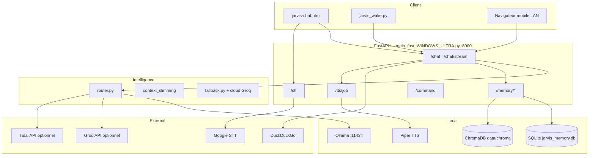

# Jarvis Assistant — Description projet

Document de présentation pour les équipes **métier** et **développement**.

---

## 1. Résumé exécutif (métier)

**Jarvis** est un assistant personnel conversationnel en français, conçu pour tourner **en local sur un PC Windows** (confidentialité, pas d’abonnement obligatoire). L’utilisateur peut :

- discuter par **texte** ou **voix** dans une interface web ;
- activer un mode **« Salut Jarvis »** : mot d’éveil, question orale, réponse parlée ;
- bénéficier d’une **mémoire persistante** (faits, historique, rappels) ;
- obtenir des réponses enrichies par une **recherche web** (actualités, météo, etc.) lorsque c’est pertinent ;
- piloter optionnellement la **musique** (Tidal) et le **volume** système par la voix.

L’architecture privilégie la **réactivité** sur du matériel modeste (ex. carte graphique 4 Go) : un petit modèle d’IA local assure l’essentiel des échanges ; un **cloud optionnel** (Groq) peut prendre le relais pour les questions complexes, avec quota journalier configurable.

**Valeur métier :**

| Besoin | Apport Jarvis |
|--------|----------------|
| Assistant du quotidien | Questions/réponses, rappels, ton personnalisable |
| Souveraineté des données | Traitement local (Ollama), mémoire sur disque |
| Accessibilité | Interface simple + commande vocale mains libres |
| Extensibilité | API REST documentée, intégration mobile (réseau local) |

---

## 2. Fonctionnalités principales

### Conversation

- Chat texte avec affichage **progressif** (streaming) ou réponse complète.
- Synthèse vocale (**TTS**) : voix française Piper (locale) ou voix Windows (SAPI).
- Reconnaissance vocale (**STT**) : micro navigateur ou **micro serveur** (plus stable sous Windows).

### Mémoire et personnalisation

- Historique des échanges (SQLite + recherche plein texte).
- **Faits mémorisés** (« retiens que… », rappel de profil utilisateur).
- **Rappels** programmables avec notification / lecture vocale.
- RAG léger (ChromaDB + embeddings) pour retrouver le contexte pertinent.

### Routage intelligent

- Analyse rapide de la requête (complexité, intention) **sans appeler le LLM**.
- Choix automatique : modèle local rapide / qualité, recherche web, ou **cloud Groq** si activé.
- Mode **réponses courtes** pour l’usage vocal.

### Commandes locales

- Volume Windows, pause/lecture (selon configuration).
- Intégration **Tidal** optionnelle (lecture, recherche) si identifiants API renseignés.

### Mode vocal autonome (`jarvis_wake.py`)

- Détection du mot d’éveil (**openWakeWord**, sans compte cloud).
- Enregistrement court après le bip, envoi à l’API, lecture de la réponse.

---

## 3. Architecture technique (développement)

### Stack

| Couche | Technologies |
|--------|----------------|
| API | Python 3, FastAPI, Uvicorn |
| LLM local | Ollama (Qwen 2.5 quantifié, politique « un seul modèle en VRAM ») |
| LLM cloud | Groq (API OpenAI-compatible), quota journalier |
| Mémoire | SQLite, FTS5, ChromaDB, `nomic-embed-text` |
| TTS | Piper (défaut) ou pyttsx3 |
| STT | Google (défaut) ou Whisper local |
| Wake word | openWakeWord + sounddevice |
| Front | `jarvis-chat.html` (statique servi par FastAPI) |
| Tests E2E | Playwright (`e2e/jarvis.spec.js`) |

### Points d’entrée

| Fichier | Rôle |
|---------|------|
| `main_fast_WINDOWS_ULTRA.py` | Serveur API principal |
| `jarvis_wake.py` | Agent vocal mot d’éveil |
| `config.py` + `.env` | Configuration centralisée |
| `memory.py` | Persistance et RAG |
| `router.py` | Routage local / cloud / web |
| `Lancer_Jarvis.bat` | Démarrage complet (Ollama + API + wake + navigateur) |

### Endpoints API clés

| Méthode | Route | Description |
|---------|-------|-------------|
| GET | `/`, `/api`, `/health`, `/status` | UI, santé, diagnostic |
| POST | `/chat`, `/chat/stream` | Conversation (JSON ou SSE) |
| GET | `/command` | Alternative GET pour scripts |
| GET/POST | `/memory/*` | Historique, faits, rappels, stats |
| POST | `/stt` | Transcription audio |
| GET | `/tts/job/{id}` | Suivi génération audio |
| GET | `/models`, `/settings` | Config UI |
| GET | `/web/search`, `/cloud/status` | Diagnostics |

Documentation interactive : `http://127.0.0.1:8000/docs` (Swagger).

### Contraintes matérielles (cible actuelle)

- Windows 10/11, **GTX 1650 4 Go** : un modèle **3B** en VRAM (`JARVIS_SINGLE_LOCAL_MODEL`), `OLLAMA_NUM_GPU` souvent à `0` pour stabilité.
- Modèles lourds bloqués par défaut (`JARVIS_BLOCKED_MODELS`).
- Préchargement Ollama au démarrage + `keep_alive` pour limiter les latences.

### Sécurité et exploitation

- API écoutant `0.0.0.0` : accessible sur le **réseau local** (téléphone) — à réserver à un LAN de confiance.
- Secrets dans `.env` (non versionné) : `CLOUD_API_KEY`, `TIDAL_*`.
- Pas d’authentification utilisateur intégrée : assistant **mono-utilisateur** personnel.

---

## 4. Prérequis et déploiement

1. **Python** + environnement virtuel `venv/`
2. **Ollama** installé avec les modèles configurés dans `.env`
3. `pip install -r requirements.txt` (+ `requirements-stt.txt`, `requirements-wake.txt` si besoin)
4. Copier `.env.example` → `.env` et adapter
5. Lancer : `Lancer_Jarvis.bat` ou `start_jarvis_api.bat`

Vérification : `python scripts/preflight.py`, tests `npm run test:e2e`.

---

## 5. Roadmap / limites connues

- Dépendance Internet pour STT Google et recherche web.
- Cloud Groq : quota journalier (`CLOUD_DAILY_LIMIT`).
- Wake word sensible au bruit ambiant et au micro.
- Tidal : configuration OAuth / CDP avancée pour une expérience fluide.

---

## 6. Glossaire

| Terme | Signification |
|-------|----------------|
| Ollama | Serveur local qui exécute les modèles de langage |
| TTS / STT | Synthèse / reconnaissance de la parole |
| RAG | Retrieval-Augmented Generation — contexte issu de la mémoire |
| SSE | Server-Sent Events — flux de texte en temps réel |
| Wake | Réveil par mot-clé (« Salut Jarvis ») |

---

*Version document : alignée sur Jarvis API 3.1 (hybride local + Groq).*
